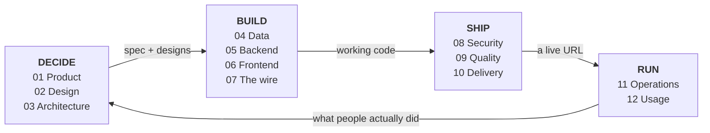
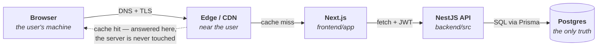

# From Idea to Click

**A field guide to everything in web development that isn't HTML.**

HTML describes what a page contains. That is roughly one concept out of sixty. This is a map of the other fifty-nine — the twelve stages a web product moves through from someone having an idea to a real person clicking a button in production, written for a first-timer and anchored to this codebase.

`12 stages` · `~90 concepts` · `Anchored to: Next.js 16 + NestJS 11` · `August 2026`

---

## The loop

The stages are a sequence, not a menu — each hands a specific artifact to the next. The arrow that matters is the one going backwards: shipping is not the end of the road, it is how you find out what to build next.

---

## Start here — the honest orientation

Three things nobody tells you at the beginning, all of which make the rest of this document make sense.

**Writing code is maybe 30% of the job.** The rest is deciding what to build, shaping data, keeping it secure, proving it works, getting it onto a server, and finding out whether anyone used it. A developer who only writes code needs eleven other people. A developer who understands all twelve stages needs three.

**Almost everything is a layer over something simpler.** React is a layer over the DOM. The DOM is a layer over HTML. Prisma is a layer over SQL. Every framework you learn is someone's opinion about a lower thing. Learn the lower thing eventually — not first, but eventually — because that is where bugs live.

**The words are worse than the ideas.** "Hydration", "idempotency", "middleware", "the event loop" all sound like a physics degree. Each one is a small idea with an intimidating name. This document gives you the small idea first and the name second.

---

## What actually happens when someone clicks

Before the twelve stages, one picture. Almost every concept in this guide is a way of making one of these hops faster, safer, or less likely to break. If you internalise this path, everything else has somewhere to attach.

Every hop is a place where things get slow, break, or leak. Performance work removes hops; security work guards them; observability work watches them. The dotted arrow is the whole business case for caching — the three boxes to its right stop existing for that request.

---

# DECIDE

## 01 · Product definition

> **Answers:** should this exist at all, and how will we know if it worked?

The stage everyone skips and everyone regrets skipping. Code is expensive to write and much more expensive to maintain, so the cheapest bug to fix is the feature you never built. This stage is about reducing what you build.

| Concept                                | What it is                                                                                                                                                                                            |
| -------------------------------------- | ----------------------------------------------------------------------------------------------------------------------------------------------------------------------------------------------------- |
| **User research**                      | Talking to the people who will use the thing, before building it. Five conversations catches most of what a year of guessing misses.                                                                  |
| **Problem statement**                  | One sentence naming who is stuck, at what, and why it matters. If you cannot write it, you do not have a project yet — you have a technology you want to use.                                         |
| **Jobs to be done**                    | Framing features as the job a user "hires" the product for. Nobody wants a saved-search feature; they want to stop refreshing a page at midnight.                                                     |
| **Requirements**                       | What the system must do (functional) and how well it must do it (non-functional: speed, uptime, privacy, legal). The second kind is the kind that gets forgotten and then rewrites your architecture. |
| **Scope & MVP**                        | The smallest version that is genuinely useful to someone. Not a broken version of the full thing — a complete version of a smaller thing.                                                             |
| **Prioritisation**                     | Ordering the backlog on a stated basis rather than on whoever spoke last. RICE (reach, impact, confidence, effort) and MoSCoW (must / should / could / won't) are just structured arguments.          |
| **Success metrics**                    | The number that moves if this worked, chosen **before** you build. Without it, every launch is a success, which means the word means nothing.                                                         |
| **User stories & acceptance criteria** | "As a buyer I want to save a listing so I can compare later" plus a checklist of what "done" means. The checklist later becomes your tests, almost word for word.                                     |

> [!WARNING]
> **Where first-timers lose months**
> Building the admin panel first. It feels productive because it is unambiguous — but nobody is waiting for it. Build the one flow that a real user would pay for, all the way through to production, before building anything else. That single vertical slice teaches you more than six horizontal ones.

**In your repo** — `horizon-grove-real-estate.md` and `frontend/docs/FRONTEND_MVP_ANALYSIS.md` are this stage's artifacts: the written argument for what the product is, produced before the code existed.

---

## 02 · Information architecture & design

> **Answers:** what goes where, what does it look like, and can everyone use it?

Design is not decoration applied at the end. It is the decision about structure — what lives on which screen, what the user sees first, and what the interface promises. Getting this wrong is a rewrite; getting the colours wrong is an afternoon.

| Concept                      | What it is                                                                                                                                                                                                             |
| ---------------------------- | ---------------------------------------------------------------------------------------------------------------------------------------------------------------------------------------------------------------------- |
| **Information architecture** | How content is organised and labelled — the navigation, the hierarchy, the naming. It is the floor plan, decided before the furniture.                                                                                 |
| **User flows**               | The step-by-step path through a task, including the unhappy ones: no results, expired session, payment declined. Most bugs users actually hit live in flows nobody drew.                                               |
| **Wireframes & prototypes**  | Low-fidelity boxes first (structure), high-fidelity later (surface). Cheap to throw away, which is the entire point.                                                                                                   |
| **Design system**            | A named, reusable set of components and rules so that a button is decided once, not forty times. The same principle as a function, applied to visual decisions.                                                        |
| **Design tokens**            | Named values for colour, spacing, type size, radius, shadow — `--space-4` rather than `16px`. Change the token, change every screen at once.                                                                           |
| **Responsive design**        | One layout that adapts across screen sizes, rather than a separate mobile site. Modern CSS (`grid`, `flex`, `clamp()`, container queries) does most of it declaratively.                                               |
| **Accessibility (a11y)**     | Making the product usable with a keyboard, a screen reader, low vision, or a shaky hand. Semantic HTML, real contrast, visible focus, labelled controls. In many jurisdictions also a legal requirement, not a nicety. |
| **Design handoff**           | Getting from a design file to code without a game of telephone — shared tokens, named components, and a developer who was in the room early.                                                                           |
| **Content design**           | The words in the interface. Button labels, empty states, error messages. "Something went wrong" is a design failure; "That email is already registered — sign in instead?" is a design.                                |

> [!NOTE]
> **Decision · design system: buy, adopt, or build**
> **Build from scratch** gives you exactly what you want and costs weeks. **Adopt a component library** (Material, Chakra) is fast and makes your product look like everyone else's. **Adopt a primitives layer** (Radix, shadcn/ui) gives you correct accessible behaviour and leaves the styling to you.
>
> **Verdict — for a first project: primitives + your own tokens.** Accessible dropdowns and dialogs are genuinely hard to write correctly and teach you nothing about your product.

**In your repo** — `styles/tokens.css` holds the named values · `styles/globals.css` the scale classes · `components/ui/` the primitives · `design-os/` the system's seed document.

---

## 03 · System architecture

> **Answers:** what are the pieces, and which one is allowed to talk to which?

Architecture is the set of decisions that are expensive to reverse. You do not need to get them right — you need to get them _written down_, so that when they turn out wrong you know what you were assuming.

| Concept                   | What it is                                                                                                                                                                                  |
| ------------------------- | ------------------------------------------------------------------------------------------------------------------------------------------------------------------------------------------- |
| **Client / server split** | Which code runs on the user's machine and which runs on yours. The rule that never changes: **anything the user can see, the user can change**, so trust nothing decided on the client.     |
| **Rendering strategy**    | Where the HTML gets built. CSR in the browser, SSR on the server per request, SSG once at build time, ISR at build time then refreshed. This choice drives speed, SEO, and hosting cost.    |
| **API design**            | The contract between frontend and backend. REST (resources and verbs), GraphQL (client asks for exactly the fields it wants), RPC/tRPC (call a function, get types for free).               |
| **Domain modelling**      | Naming the real-world things — Property, Offer, Viewing, Transaction — and their rules, before naming any tables or components. Get the nouns right and the code organises itself.          |
| **Layered architecture**  | Controller (handles HTTP) → service (business rules) → repository (talks to the database). Each layer only knows the one below. Feels like bureaucracy until the day you swap the database. |
| **Monolith vs. services** | One deployable unit vs. many small ones. Microservices trade a hard code problem for a hard networking problem.                                                                             |
| **Statelessness**         | A server that keeps nothing in memory between requests can be duplicated freely behind a load balancer. State goes in the database or the cache, never in the process.                      |
| **ADR**                   | Architecture Decision Record — a short file saying what you decided, what you rejected, and why. Three paragraphs that save an argument every six months.                                   |

> [!NOTE]
> **Decision · rendering strategy**
> Public pages that must be found by Google and load instantly want **SSR or SSG** — the HTML arrives complete. Logged-in dashboards want **CSR** behind an auth check — the content is private, so SEO is irrelevant and caching is impossible anyway.
>
> **Verdict — the split is per-route, not per-app.** Marketing pages server-rendered, dashboards client-rendered, in the same codebase, which is exactly what the App Router is designed for.

> [!NOTE]
> **Decision · REST, GraphQL, or RPC**
> **GraphQL** earns its complexity when many different clients need different shapes of the same data. **RPC** shines when one team owns both ends and wants types to flow across the boundary automatically. **REST** is boring, universally understood, cacheable by every proxy on the internet, and debuggable with `curl`.
>
> **Verdict — start with REST.** You will know when you have outgrown it, and you will not have guessed.

**In your repo** — `app/(public)/` server-renders, `app/admin|agent|dashboard/` are client-side portals · `backend/src/modules/` is one folder per domain noun · `backend/src/common/repos/` is the layer boundary.

---

# BUILD

## 04 · The data layer

> **Answers:** what is true, where is it stored, and how do we change it without losing it?

Code is disposable; data is not. You will rewrite your frontend twice and your API once, and the database will outlive all of it. This is the stage where care pays the most compound interest.

| Concept                         | What it is                                                                                                                                                                         |
| ------------------------------- | ---------------------------------------------------------------------------------------------------------------------------------------------------------------------------------- |
| **Relational database**         | Data in tables with enforced relationships and types (Postgres, MySQL). The database itself refuses to store nonsense, which is a feature you will come to love.                   |
| **Document / key-value stores** | Flexible-shape documents (MongoDB) or fast key lookups (Redis). Trade guarantees for flexibility or speed.                                                                         |
| **Schema & normalisation**      | Deciding tables, columns, and where each fact lives. Normalising means storing each fact exactly once, so it cannot disagree with itself.                                          |
| **Relationships**               | One-to-many (an agent has many listings), many-to-many (a buyer saves many properties, a property is saved by many buyers), enforced by foreign keys.                              |
| **Indexes**                     | A lookup structure that turns "read every row" into "jump straight there". The single highest-leverage performance fix in most applications, and the most commonly missing one.    |
| **Transactions & ACID**         | Grouping several writes so that either all of them happen or none do. Accepting an offer while marking a property sold must not half-succeed.                                      |
| **ORM**                         | Object-Relational Mapper — write TypeScript, get SQL (Prisma, Drizzle). Convenient and type-safe until it silently issues 400 queries in a loop; see N+1.                          |
| **Migrations**                  | Versioned, ordered, replayable schema changes checked into git. This is how the database in production catches up with the code, safely and identically every time.                |
| **Seeding**                     | A script that fills an empty database with realistic sample data so any developer can run the app in one command.                                                                  |
| **Caching**                     | Keeping a copy of an expensive answer somewhere cheap: in memory, in Redis, in the browser, at the CDN. The permanent cost is **invalidation** — knowing when the copy went stale. |
| **Blob storage**                | Files (property photos, PDFs) belong in object storage such as S3, with only the URL in the database. Databases are bad at megabytes.                                              |
| **Backups**                     | A backup you have never restored is a rumour. The number that matters is not "do we have backups" but "how long does a restore take".                                              |

> [!NOTE]
> **Decision · SQL or NoSQL**
> The honest version: **if your data has relationships, use a relational database.** Almost all business data has relationships. NoSQL is the right call for genuinely schemaless documents, extreme write volume, or caching — not for "I don't want to write migrations".
>
> **Verdict — Postgres until proven otherwise.** It also does JSON, full-text search, and geographic queries, which covers the usual reasons people reach elsewhere.

> [!WARNING]
> **The N+1 query**
> You fetch 50 properties (1 query), then loop over them to fetch each agent (50 more queries). The page takes four seconds and nobody knows why. Every ORM has a way to fetch related records in one go — in Prisma, `include`. Learn to read the query log early; this bug is invisible in code review and obvious in the log.

**In your repo** — `backend/prisma/schema.prisma` is the single source of truth for every shape in the system · `backend/prisma/seed.ts` fills a fresh database · `pnpm db:setup` does generate, push, and seed in one step.

---

## 05 · Backend engineering

> **Answers:** what happens between the request arriving and the response leaving?

The backend is the part of the system the user cannot lie to. It holds the rules, guards the data, and is the only place a decision can be trusted.

| Concept                               | What it is                                                                                                                                                                                                                   |
| ------------------------------------- | ---------------------------------------------------------------------------------------------------------------------------------------------------------------------------------------------------------------------------- |
| **HTTP**                              | The request/response protocol the whole web runs on. Methods (GET, POST, PATCH, DELETE), status codes (200 fine, 401 who are you, 403 not allowed, 404 no such thing, 500 we broke), headers (metadata), body (the payload). |
| **Routing**                           | Mapping an incoming URL and method to the function that handles it.                                                                                                                                                          |
| **Middleware**                        | Functions that run before your handler, in order — parse the body, check the token, log the request, catch the error. A pipeline, not magic.                                                                                 |
| **Controller / service / repository** | Controllers translate HTTP into plain arguments, services hold the business rules, repositories talk to the database. Business logic in a controller is the most common structural mistake in backend code.                  |
| **Authentication**                    | Proving who you are. Passwords (hashed with bcrypt or argon2, never stored or reversible), OAuth/OIDC for "sign in with Google", magic links, passkeys.                                                                      |
| **Authorisation**                     | What you are allowed to do once identified. An agent may edit their own listing and not someone else's. **A different problem from authentication**, and the more commonly broken one.                                       |
| **Sessions vs. tokens**               | _Session_: the server remembers you, the browser holds an opaque cookie. _JWT_: a signed, self-describing token the server can verify without a lookup — fast, but genuinely awkward to revoke.                              |
| **Validation**                        | Rejecting malformed input at the boundary, with a schema (Zod, class-validator). Everything past the boundary is then known-good. Client-side validation is a courtesy; server-side validation is the actual defence.        |
| **Error handling**                    | Turning thrown exceptions into consistent, non-leaky HTTP responses. Users get a clear message; the stack trace goes to your logs, never to the browser.                                                                     |
| **Background jobs & queues**          | Work too slow to make the user wait for: sending email, generating a PDF, resizing an image. Put it on a queue (BullMQ, SQS), return immediately, do it in a worker.                                                         |
| **Scheduled jobs**                    | Cron-style recurring work — nightly digests, expiring old offers, reconciliation.                                                                                                                                            |
| **File uploads**                      | Usually a pre-signed URL: the server grants a one-time permission and the browser uploads straight to storage, so large files never pass through your API.                                                                   |
| **Webhooks**                          | Another service calling _you_ when something happens ("payment succeeded"). Always verify the signature — the URL is public.                                                                                                 |
| **Real-time**                         | WebSockets for two-way live data (chat), SSE for one-way server push (notifications), polling for everything else because it is simple and usually enough.                                                                   |
| **Rate limiting**                     | Capping requests per client so one bad actor or one broken loop cannot take the service down.                                                                                                                                |
| **Idempotency**                       | Making a repeated request safe. The user double-clicks "Submit offer"; an idempotency key ensures one offer, not two. Networks retry on their own, so this is not paranoia.                                                  |

> [!NOTE]
> **Decision · sessions or JWTs**
> JWTs are marketed as the modern default. They are excellent for service-to-service calls and for stateless horizontal scale. For a normal web app with a login form, they mostly hand you a logout problem: a signed token stays valid until it expires, so "sign out everywhere" needs a blocklist — at which point you have rebuilt sessions, worse.
>
> **Verdict — first app: server sessions in an httpOnly cookie.** Reach for JWTs when you have a second consumer that cannot share a session store.

> [!NOTE]
> **Decision · do it now or queue it**
> If the user must see the result to continue, do it in the request. If they only need to know it was accepted — email, receipts, image processing, third-party sync — queue it. The test is not "is it slow", it is **"does the user's next action depend on it"**.
>
> **Verdict** — queues add a moving part. Add the first one when a request crosses ~1s, not before.

**In your repo** — `backend/src/modules/offers/` is the controller-service-repo trio for one domain · `backend/src/common/filters/` shapes errors · `backend/src/common/interceptors/` is the cross-cutting pipeline · `@nestjs/jwt` + `@nestjs/passport` carry auth.

---

## 06 · Frontend engineering

> **Answers:** how does data become pixels, and how does clicking change anything?

This is where HTML lives — as roughly a tenth of the work. The other nine tenths are state, styling, data fetching, and the build pipeline that turns your source into something a browser will accept.

| Concept                                  | What it is                                                                                                                                                                                                                                                   |
| ---------------------------------------- | ------------------------------------------------------------------------------------------------------------------------------------------------------------------------------------------------------------------------------------------------------------ |
| **The DOM**                              | The live tree of objects the browser builds from your HTML. HTML is the blueprint; the DOM is the building, and JavaScript renovates it while people are inside.                                                                                             |
| **CSS: cascade, specificity, box model** | Why one rule beats another, and how size, padding, border, and margin combine. Most "CSS is broken" moments are one of these three misunderstood.                                                                                                            |
| **Layout**                               | Flexbox for one direction, Grid for two, container queries for components that adapt to their slot rather than the screen.                                                                                                                                   |
| **JavaScript & the event loop**          | One thread doing everything. Slow synchronous work freezes the interface — which is why anything that waits (network, timers) is asynchronous, via promises and `async/await`.                                                                               |
| **TypeScript**                           | JavaScript with types checked before the code runs. It catches an entire class of bug at your desk instead of in production, and doubles as documentation that cannot go stale.                                                                              |
| **Components**                           | A named piece of interface with its own markup, style, and behaviour, composed like functions. The unit of reuse in every modern framework.                                                                                                                  |
| **Declarative rendering**                | You describe what the UI should look like _for a given state_; the framework works out the DOM changes. The mental shift from "find the element and update it" to "change the state" is the big one.                                                         |
| **Server state vs. client state**        | _Server state_ is a copy of something that lives in the database — it can be stale, needs refetching, can fail. _Client state_ is yours alone: which tab is open, is this drawer expanded. Confusing the two is the most common frontend architecture error. |
| **Data fetching & caching**              | A library (TanStack Query, SWR) that handles loading states, errors, retries, deduplication, background refresh, and cache invalidation so you stop hand-rolling all six.                                                                                    |
| **Routing**                              | Mapping URLs to screens on the client, with the back button, deep links, and shareable URLs still working. The URL is state — treat it as such.                                                                                                              |
| **Forms & validation**                   | Controlled inputs, per-field errors, submission states, and a schema shared with the backend so both sides agree on what is valid.                                                                                                                           |
| **Hydration**                            | Server-rendered HTML arrives, then JavaScript "wakes it up" by attaching event handlers. A hydration mismatch means the server and browser rendered different things — usually a date, a random value, or something read from `window`.                      |
| **The build pipeline**                   | Transpiling (modern syntax → syntax browsers support), bundling (many files → few), tree-shaking (drop unused code), minifying (shorten it), code-splitting (load per route). Vite, Turbopack, and esbuild do this for you.                                  |
| **Assets**                               | Images (modern formats, correct dimensions, lazy loading), fonts (subset, preload, avoid the invisible-text flash), icons. Usually the largest thing on the page and the easiest performance win.                                                            |
| **Internationalisation**                 | Text, dates, currency, and number formats that adapt to locale — plus right-to-left layouts. Retrofitting it is agony; leaving room for it is nearly free.                                                                                                   |
| **Accessibility in code**                | Semantic elements, keyboard operability, visible focus, ARIA only where HTML falls short, and honouring `prefers-reduced-motion`.                                                                                                                            |

> [!NOTE]
> **Decision · where does state live**
> Reach in this order: **URL** (shareable, survives refresh — filters, tabs, page number) → **local component state** (nothing else cares) → **server-state library** (it came from an API) → **global store** (genuinely app-wide, like a theme).
>
> **Verdict — a global store is the last resort, not the starting point.** Most Redux tutorials solve a problem a query library solves better, and putting server data in a global store means you now own cache invalidation by hand.

> [!WARNING]
> **Two sizes in one card**
> An interface reads as amateur mostly through _density_, not colour. Dashboards, tables, and forms are an application register: small type, tight rows, one emphasised value per card, differences carried by weight and colour rather than size. Big display type belongs on marketing pages. This is the single fastest way to make a first project stop looking like a first project.

**In your repo** — `lib/api/client.ts` is the only place that talks HTTP · `lib/api/properties.ts` wraps the endpoints · `lib/hooks/use-properties.ts` wraps that in a query hook · components consume the hook and never the client. That chain is the pattern, repeated 13 times.

---

## 07 · The wire between them

> **Answers:** how does a request physically get from a phone to your server and back?

The layer people skip until something inexplicable happens. Every developer eventually loses a day to CORS or a cookie that will not stick, and the day is much shorter if you have read this page once.

| Concept                           | What it is                                                                                                                                                                                                                           |
| --------------------------------- | ------------------------------------------------------------------------------------------------------------------------------------------------------------------------------------------------------------------------------------ |
| **DNS**                           | Turning a name into an address. Records (`A`, `CNAME`, `MX`) and TTL, which is why a change "hasn't gone live yet" — something cached the old answer.                                                                                |
| **TLS / HTTPS**                   | Encryption in transit, via a certificate proving the server is who it claims. Free and automatic now; there is no remaining reason for a site to be on plain HTTP.                                                                   |
| **HTTP versions**                 | 1.1 one request at a time per connection, 2 many multiplexed over one, 3 the same over QUIC, which recovers better on flaky mobile networks.                                                                                         |
| **Same-origin policy**            | The browser's core safety rule: a page from one origin cannot freely read another's responses. Everything confusing about CORS follows from this being a good idea.                                                                  |
| **CORS**                          | The server's way of saying "this other origin may read my responses". The fix is always a **response header from the server** — never something you can patch in the browser, however many Stack Overflow answers suggest otherwise. |
| **Cookies**                       | Small values the browser stores and re-sends. The flags are the whole game: `httpOnly` (JavaScript cannot read it), `Secure` (HTTPS only), `SameSite` (blocks cross-site sending — your main CSRF defence).                          |
| **HTTP caching**                  | `Cache-Control`, `ETag`, and revalidation — how browsers and CDNs decide whether to reuse a response. Free performance, correctly configured; baffling staleness, incorrectly.                                                       |
| **CDN**                           | Copies of your static assets in dozens of cities, so bytes travel a short distance. Physics is the last unfixable latency.                                                                                                           |
| **Load balancer / reverse proxy** | A front door that spreads traffic across servers, terminates TLS, and hides your topology (nginx, Caddy, or your host's).                                                                                                            |
| **Edge functions**                | Small bits of your code running at the CDN, close to the user — redirects, auth checks, A/B splits — before the request ever reaches the origin.                                                                                     |

**In your repo** — `middleware.ts` runs at the edge on every matching request, the cheapest possible place to bounce a logged-out user · `lib/constants.ts` holds `config.api.*` so no URL is ever typed twice.

---

# SHIP

## 08 · Security & privacy

> **Answers:** what happens when someone actively tries to break this?

Not a feature you add at the end. Most of security is a handful of habits applied consistently: validate at the boundary, check permissions on every request, never trust the client, and keep dependencies current.

| Concept                               | What it is                                                                                                                                                                                                                                  |
| ------------------------------------- | ------------------------------------------------------------------------------------------------------------------------------------------------------------------------------------------------------------------------------------------- |
| **Broken access control**             | The most common serious flaw on the web. Changing `/offers/123` to `/offers/124` and seeing someone else's data. Every single request must re-check **who you are** and **whether this row is yours** — hiding the button is not a control. |
| **Injection**                         | User input interpreted as code. SQL injection, command injection. Parameterised queries and real ORMs close it — string-concatenating a query never does.                                                                                   |
| **XSS**                               | Attacker JavaScript running on your page, usually via unescaped user content. Frameworks escape by default; the danger is the escape hatch (`dangerouslySetInnerHTML`).                                                                     |
| **CSRF**                              | Another site making an authenticated request as your logged-in user. `SameSite` cookies plus a token.                                                                                                                                       |
| **Security misconfiguration**         | Default credentials, debug mode in production, an open storage bucket, verbose stack traces. Boring, extremely common, entirely preventable.                                                                                                |
| **Supply chain**                      | You did not write 99% of your `node_modules`. Lockfiles, `pnpm audit`, pinned versions, and scepticism about adding a dependency to save nine lines. Now its own OWASP category, on the strength of real incidents.                         |
| **Secrets management**                | API keys and database URLs in environment variables or a secret manager — never in the repo, never in client-side code. Anything shipped to the browser is public, including "private" keys in a bundle.                                    |
| **Content Security Policy**           | A header telling the browser which scripts and styles are allowed to run. Real defence-in-depth against XSS.                                                                                                                                |
| **Cryptographic failures**            | Sensitive data unencrypted at rest or in transit, weak hashing, home-made crypto. Use the boring library everyone else uses.                                                                                                                |
| **Logging & alerting failures**       | If you cannot tell that you were attacked, you were still attacked. Log auth events and permission denials — and never log passwords, tokens, or full card numbers.                                                                         |
| **Mishandled exceptional conditions** | New in 2025: what your code does when things go wrong — swallowed errors, failing _open_ instead of closed, half-finished writes. A permission check that throws and gets caught by a bare `catch` has just granted access.                 |
| **Privacy & compliance**              | GDPR and friends: collect the minimum, say why, allow deletion and export, keep it only as long as needed. Legal obligations with engineering consequences — "delete my account" has to actually delete things.                             |

> [!CAUTION]
> **The one to internalise on day one**
> **Authorisation is checked on the server, per request, per row.** Not by hiding the button, not by the route the client took to get there, not once at login. If your API can be called directly with a valid token and someone else's ID, that is the only fact that matters. This has been the number-one item on the OWASP Top 10 for four consecutive editions.

**In your repo** — `backend/src/common/filters/` is where a thrown error becomes a safe response, the boundary that decides whether stack traces leak · guards on the module controllers are where per-row ownership gets checked.

---

## 09 · Quality engineering

> **Answers:** how do we know it works, and how do we know we did not break it?

Tests are not about proving code correct. They are about changing code six months later without fear. That is the entire return, and it is enormous.

| Concept                            | What it is                                                                                                                                                                                  |
| ---------------------------------- | ------------------------------------------------------------------------------------------------------------------------------------------------------------------------------------------- |
| **Unit tests**                     | One function, no database, no network. Fast enough to run on every save. Best on logic with real rules — pricing, permissions, date maths.                                                  |
| **Integration tests**              | Several pieces together — a route, its service, a real test database. Catches the wiring mistakes unit tests structurally cannot see.                                                       |
| **End-to-end tests**               | A real browser doing what a user does (Playwright, Cypress). Slow and occasionally flaky, so reserve them for the handful of flows that must never break: sign up, search, submit an offer. |
| **The testing pyramid**            | Many unit, some integration, few end-to-end. Inverting it gives you a suite that takes forty minutes and that nobody trusts.                                                                |
| **Test doubles**                   | Stubs, mocks, and fakes standing in for slow or external things. Mock the payment provider, not your own database.                                                                          |
| **Static analysis**                | Finding problems without running anything: the type-checker, the linter, dependency scanners. The cheapest tests you will ever run.                                                         |
| **Linting & formatting**           | ESLint catches likely mistakes; Prettier ends the argument about style by removing the choice. Run both automatically so neither is ever a review comment.                                  |
| **Code review**                    | Another person reading the change before it lands. Its real value is shared understanding — the bugs it catches are a bonus.                                                                |
| **Accessibility & visual testing** | Automated a11y checks (axe) catch perhaps a third of issues; keyboard-only testing catches most of the rest. Visual regression testing flags unintended pixel changes.                      |
| **Performance budgets**            | A stated ceiling — bundle size, load time — enforced in CI, so performance degrades visibly instead of quietly.                                                                             |

> [!NOTE]
> **Decision · where to spend limited testing effort**
> A first-timer aiming for "good coverage" writes a hundred tests asserting that getters return values, then still ships a broken checkout. Coverage percentage measures lines executed, not risk covered.
>
> **Verdict** — in order: **types and lint on everything** (nearly free) → **integration tests on the money paths** → **unit tests on genuinely tricky logic** → **three or four end-to-end tests** on the flows that would be an emergency. Ignore the coverage number.

**In your repo** — `pnpm type-check` and `pnpm lint` on both sides · Jest configured backend-side with `backend/test/jest-e2e.json` · husky + lint-staged run the formatter on staged files, so quality gates fire before a commit exists.

---

## 10 · Build & delivery

> **Answers:** how does code on your laptop become a URL other people can visit?

The gap between "works on my machine" and "works for everyone" is this stage. Automate it early — the discipline is worth more than the time saved.

| Concept                            | What it is                                                                                                                                                                                     |
| ---------------------------------- | ---------------------------------------------------------------------------------------------------------------------------------------------------------------------------------------------- |
| **Version control**                | Git: branches, commits, merges, pull requests, tags. The undo history for your entire project, and the coordination layer for everyone touching it.                                            |
| **Branching strategy**             | Trunk-based (short branches, merge daily) or Git Flow (long-lived release branches). Short branches merged often cause dramatically less pain.                                                 |
| **Environments**                   | Local → preview → staging → production, each with its own database and configuration. Never point a preview environment at the production database; it will be deleted eventually.             |
| **Configuration**                  | Everything that differs per environment lives in environment variables, validated at startup so a missing one fails immediately rather than at 3am.                                            |
| **CI**                             | Continuous Integration — on every push, a machine installs, lints, type-checks, tests, and builds. It is the "works on my machine" cure.                                                       |
| **CD**                             | Continuous Delivery/Deployment — a passing build goes out automatically, or with one click. Many small deploys are far safer than one big one.                                                 |
| **Build artifact**                 | The compiled, self-contained output that gets deployed. Built once, promoted through environments unchanged, so what you tested is what runs.                                                  |
| **Containers**                     | Docker packages your app with its exact runtime and libraries so it behaves identically everywhere. Kubernetes orchestrates many of them — and is almost always premature for a first project. |
| **Serverless & managed platforms** | You supply code, the platform supplies servers, scaling, and TLS (Vercel, Netlify, Fly, Render). Less control, dramatically less to know.                                                      |
| **Infrastructure as code**         | Your servers, databases, and DNS defined in files (Terraform, Pulumi) rather than clicked into a console — reviewable, repeatable, and recoverable.                                            |
| **Deployment strategies**          | Blue-green (two environments, flip traffic), canary (5% of users first), rolling. All exist so a bad deploy is reversible in seconds.                                                          |
| **Feature flags**                  | Shipping code that is switched off, then enabling it for a few users. Decouples _deploying_ from _releasing_ — and turns a rollback into a toggle.                                             |
| **Migrations in production**       | Schema changes against a live database with real users. The rule is **expand, then contract**: add the new column, write to both, backfill, switch reads, only then drop the old one.          |
| **Rollback**                       | The plan for when it goes wrong. If your answer is "fix forward under pressure at midnight", you do not have one.                                                                              |

> [!NOTE]
> **Decision · managed platform or your own server**
> A VPS costs $5/month and teaches you Linux, nginx, systemd, TLS renewal, and log rotation. A managed platform costs more and teaches you almost none of that, but ships today with preview URLs and automatic HTTPS.
>
> **Verdict — managed for the product, a VPS as a side quest.** Learning to run a server is genuinely valuable, just not while you are also learning everything else and trying to launch something.

**In your repo** — `pnpm build` produces the artifact on both sides · `backend/dist/` is the compiled output · husky hooks are the local half of CI. The missing half is a pipeline file that runs lint, type-check, and test on every push.

---

# RUN

## 11 · Operations

> **Answers:** is it up right now, and how would we know before the users tell us?

Software runs for years and fails at inconvenient times. Operations is the discipline of finding out first, and of being able to answer "what changed?" quickly.

| Concept                               | What it is                                                                                                                                                            |
| ------------------------------------- | --------------------------------------------------------------------------------------------------------------------------------------------------------------------- |
| **Logging**                           | Structured records of what happened, with a request ID threading one user's journey across services. Searchable JSON beats `console.log` the first time you need it.  |
| **Metrics**                           | Numbers over time: requests per second, error rate, latency, queue depth. Watch **p95 and p99**, not averages — the average is fine while 5% of users are suffering.  |
| **Tracing**                           | Following one request through every service and query to see where the time actually went. The cure for "the page is slow, but which part".                           |
| **Error tracking**                    | Sentry and similar: exceptions grouped, deduplicated, and attached to the release that introduced them.                                                               |
| **Uptime monitoring & health checks** | An endpoint saying "I am alive and my database answers", polled from outside your infrastructure.                                                                     |
| **Alerting**                          | Notifying a human when a number crosses a line. Alert on **symptoms users feel**, not on every anomaly — an alert that fires daily gets ignored within a week.        |
| **SLI / SLO / error budget**          | An indicator you measure, a target you promise (99.9%), and the amount of failure that target permits. Turns "should we ship risky things this week" into arithmetic. |
| **Incident response**                 | Detect, mitigate, communicate, then fix. **Mitigate before diagnosing** — roll back first, understand afterwards.                                                     |
| **Blameless postmortem**              | Writing down what happened and which _system_ allowed it. Blaming a person guarantees the next person hides the next incident.                                        |
| **Scaling**                           | Vertical (bigger machine — simple, has a ceiling) and horizontal (more machines — needs statelessness). Nearly always fix the slow query before adding machines.      |
| **Cost management**                   | Cloud bills grow quietly. A forgotten cron job, an unindexed query, or an unbounded log retention policy can cost more than the servers.                              |

**In your repo** — `backend/src/common/interceptors/` is where request logging and timing belong: one place, every route. Note the project rule banning `console.log` in committed code — logging is a service, not a debug statement.

---

## 12 · Usage, growth & the loop back

> **Answers:** did anyone find it, did it help, and what should we build next?

The stage that closes the circle and gets neglected the most. Everything up to here is cost. This is where you find out whether it bought anything.

| Concept                       | What it is                                                                                                                                                                                                        |
| ----------------------------- | ----------------------------------------------------------------------------------------------------------------------------------------------------------------------------------------------------------------- |
| **SEO**                       | Being findable. Server-rendered content, sensible URLs, unique titles and meta descriptions, a sitemap, internal links, and pages that are actually fast.                                                         |
| **Structured data**           | Schema.org JSON-LD describing your content in a form search engines understand — a listing's price, address, and photos, marked up so results show them.                                                          |
| **Core Web Vitals**           | Google's measured user-experience thresholds, evaluated at the 75th percentile of real visits: **LCP ≤ 2.5s** (main content visible), **INP ≤ 200ms** (interface responds), **CLS ≤ 0.1** (nothing jumps around). |
| **RUM vs. synthetic**         | Real user monitoring measures actual visitors on real devices and networks; synthetic (Lighthouse) tests a lab machine. Lab scores are a smoke alarm, field data is the truth.                                    |
| **Product analytics**         | Events describing what users do — viewed listing, saved, contacted agent. Design the event names deliberately; renaming them later loses the history.                                                             |
| **Funnels & cohorts**         | Where people drop out of a multi-step flow, and how behaviour differs between groups who joined at different times.                                                                                               |
| **A/B testing**               | Two versions, randomly assigned, measured. Only meaningful with enough traffic and a metric chosen before you look — otherwise you are reading noise confidently.                                                 |
| **Session replay & heatmaps** | Watching anonymised recordings of real sessions. Ten minutes of this reliably beats an hour of speculation — mind the privacy implications and mask sensitive fields.                                             |
| **Feedback channels**         | Support tickets, in-app prompts, interviews. Analytics tells you _what_ happened; only people tell you _why_.                                                                                                     |
| **Iteration**                 | Feeding all of the above back into stage 01. This is what makes the diagram a loop and not a line — and it is the difference between a product and a project.                                                     |

> [!WARNING]
> **The measurement trap**
> Tracking everything produces a dashboard nobody reads. Pick the **three** numbers that would change a decision — one acquisition, one activation, one retention — and instrument those properly. Add the fourth only when someone asks a question the first three cannot answer.

**In your repo** — nothing yet: no analytics, no metadata strategy, no Web Vitals reporting. That is normal at this point and worth naming. The project currently has eleven stages out of twelve, and stage 12 is the one that tells you which of the other eleven to work on next.

---

## Cross-cutting concerns

Not a stage — these run through all twelve, which is exactly why they get dropped.

| Concept            | What it is                                                                                                                                                                                                         |
| ------------------ | ------------------------------------------------------------------------------------------------------------------------------------------------------------------------------------------------------------------ |
| **Documentation**  | A README that gets a new machine running, an architecture note explaining the shape, and comments only where the _why_ is not visible in the code. Docs that live next to the code stay alive; docs in a wiki die. |
| **Team process**   | Agile, Scrum, Kanban — all attempts at the same thing: small batches, visible work, frequent feedback. The ceremony is negotiable; the small batches are not.                                                      |
| **Estimation**     | Universally bad. Estimate in relative sizes, track how wrong you were, and let the record replace the argument.                                                                                                    |
| **Technical debt** | Shortcuts taken deliberately, with interest paid later in slower changes. Debt is a legitimate tool when named and scheduled; it is only fatal when it is invisible.                                               |
| **Refactoring**    | Changing structure without changing behaviour. Only safe when you have tests, which is the real reason to have tests.                                                                                              |
| **Licensing**      | Every dependency comes with terms. MIT and Apache are permissive; GPL and AGPL have obligations that can reach your own code.                                                                                      |
| **Legal surface**  | Terms of service, privacy policy, cookie consent, accessibility obligations, data residency. Not engineering — but engineering has to implement it.                                                                |
| **Ethics**         | Dark patterns, manipulative defaults, data you collect because you can. The person choosing is usually a developer, quietly, at 4pm.                                                                               |

---

## If you are starting from zero

Ninety concepts is a map, not a syllabus.

The mistake is learning breadth-first — a week of HTML, a week of CSS, a week of JavaScript, and no working thing at the end. Learn **depth-first through one vertical slice**: one feature, taken all the way from idea to a URL a friend can open. You will touch ten of the twelve stages shallowly, and every later concept will have somewhere to attach.

1. **Make one page real.** HTML structure, CSS layout with flexbox and grid, and enough JavaScript to change something on click. No framework, no build tool. Understand the DOM before you understand the thing that hides it.
2. **Put it on the internet.** Git, GitHub, and a static host. Do this absurdly early. A live URL changes how the whole thing feels, and it makes stage 10 concrete instead of theoretical.
3. **Add a framework and TypeScript.** Components, props, state, and declarative rendering. Then add types, sooner than feels comfortable — retrofitting types onto a grown codebase is far harder than starting with them.
4. **Give it a backend and a database.** One table, one API returning JSON, one page reading it. This is the moment the client/server split stops being an abstraction. Postgres and a relational schema.
5. **Add login.** The single most educational feature you can build. It forces hashing, sessions or tokens, cookies and their flags, middleware, protected routes, and authorisation — six stages at once, and you will never forget any of them.
6. **Break it on purpose, then watch it.** Try to read another user's data through your own API. Fix what you find. Add error tracking and structured logging. This is where you stop being a beginner.
7. **Automate the gate.** CI running lint, type-check, and a handful of tests on every push. Now you can change things without fear, which is the point of all of it.
8. **Find out if anyone used it.** Analytics on three events, Web Vitals in the field, and one conversation with a real user. Then go back to stage 01 with something better than an opinion.

> [!WARNING]
> **What to deliberately not learn yet**
> Kubernetes, microservices, GraphQL, Redux, monorepo tooling, WebAssembly, and every "advanced patterns" course. Each solves a problem created by scale you do not have. Learning the solution before you have felt the problem is how people end up with a nine-service architecture serving forty users.

**Why "one vertical slice" beats "learn the fundamentals first"** — fundamentals are essential and almost impossible to absorb in the abstract. You cannot really understand why the same-origin policy exists until a request of yours has been blocked by it; you cannot appreciate migrations until you have changed a column on a database with data you cared about. The slice generates the questions, and questions make the fundamentals stick. Go back and study the low layers deliberately, after you have been bitten by them once.

---

## Notes on currency

Concepts age slowly, thresholds and rankings do not. The two facts in this guide with expiry dates were checked against current sources in August 2026: the Core Web Vitals thresholds in stage 12, and the OWASP category names and ordering in stage 08 — which reflect the **2025 revision**, finalised January 2026, adding Software Supply Chain Failures and Mishandling of Exceptional Conditions as new categories.

- [OWASP Top 10:2025](https://owasp.org/Top10/2025/) — the official category list
- [web.dev · Core Web Vitals](https://web.dev/articles/vitals) — metric definitions and thresholds
- [Core Web Vitals explained (2026)](https://www.corewebvitals.io/core-web-vitals) — LCP, INP and CLS thresholds
- [Qualys · what changed in the OWASP Top 10 2025](https://blog.qualys.com/qualys-insights/2026/06/15/what-changed-in-owasp-top-10-2025-and-recommendations-for-each-category)

---

_Field guide · twelve stages · anchored to a Next.js 16 + NestJS 11 codebase. A styled HTML version of this document lives at the workspace root as `from-idea-to-click.html`._
